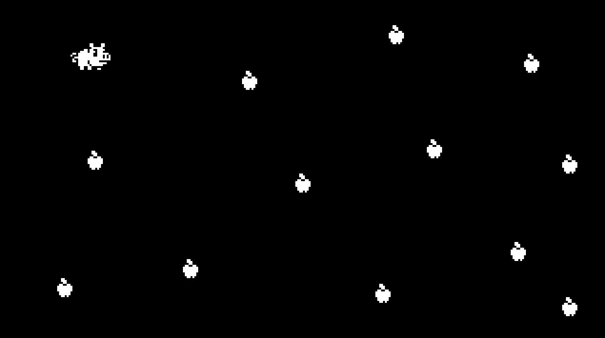

# Piggy Game
Godot 3.5.x

A basic game made in Godot, following the course: https://heartbeast-gamedev-school.teachable.com/p/1-bit-godot-course

## Screenshots

## Nodes Used

- Node
  - Node2D
    - Area2D
    - CollisionShape2D
  - AnimationPlayer

## Window

- **Window Height** and **Width**.
- **Test Height** and **Test Width** (what the actual game view will measure).
- **Stretch Mode 2D** to make the world stretch to cover the Test size.

## Input

- Using `Input.is_action_pressed("ui_right")` to react to input.
- Using `delta` to adapt speed to frame duration.
- Moving the transform with `position.x += dx` and `position.y += dy`

## Scripts

- Export properties using `export (int) var PIG_SPEED = 100`
- Accessing nodes with `onready var animPlayer = $PigAnimationPlayer`

## Scenes

- Extracting branch off of the main scene into a separate scene.

## Animation

- Creating `Idle` and `Run` animations with looping.
- Playing animations with `animPlayer.play("Run")`
- Flipping H with `sprite.flip_h = isMovingLeft`

## Collisions

- Detect collisions with a `Signal` using `func _on_Pig_area_entered(area)`
- Remove nodes from the scene (destroy) with `area.queue_free()`
- Get all overlapping areas with `var areas = get_overlapping_areas()`
- Scaling up on each apple eaten using `scale *= 1.1`

## Collision Layers and Masks

- Naming the `2D Physics` layers.
- Assigning a `Layer` and a `Mask` to the `Area2D`
  - `Layer` means what layer the area is on.
  - `Mask` means what layer the area will collide with.
